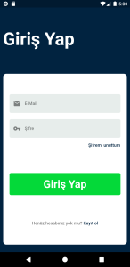

# Seyahat Asistanı

Seyahat asistanı ile ilk amacımız şöförleri gerektiği yerlerde uyararak dikkatli olmalarını sağlamaktır. Uygulama apay zeka ile göz takibi yapıp şoförün gözleri kapandığında sesli uyarı verir. Aynı zamanda bulundukları bölgelerde kaza, yolda buzlanma gibi olağan dışı durumlarda onlara bunu bildirmektir. Bulundukları bölgenin hava durumuna da bakarak olası ihtimalleri şöföre bildirir.

İkinci amacımız ise bütün bunlara gerek kalmaması için yürüyebilecekleri mesafelerde insanlara yürümeyi seçerek çevreye ve kendilerine neler kazandırabileceklerini, arabayla giderek de neler kaybedebileceklerini göstererek insanları yürümeye teşvik etmeyi amaçladık.

## Desteklenen platformlar

* Flutter Android

## Nasıl Çalışır
Kodları indirdikten sonra terminalinizde ` flutter pub get ` komutunu çalıştırdıktan sonra projeyi herhangi bi emulatorde çalıştırabilirsiniz. Yapay zekayı test edebilmek için fiziki bi cihazda denemenizi tavsiye ederiz

## Kullanılan Kütüphaneler

### Flutter
Projemizi [Flutter](https://flutter.dev) ile geliştirdik

### Firebase
Firebase'i kullanıcı bilgileri ve harita verileri için kullandık

### Google ML Kit
Google ML Kit'i kullanıcının göz kapaklarını takip etmek için kullandk

### Google Maps
Google Maps'i kullanıcıların durum tanımlaması ve seyahatlarini girebilmeleri için kullandık

### Mobx
State management olarak Mobx'i seçtik

### openweathermap.org
Hava durumu bilgilerini [open weather](https://openweathermap.org)'dan aldık

